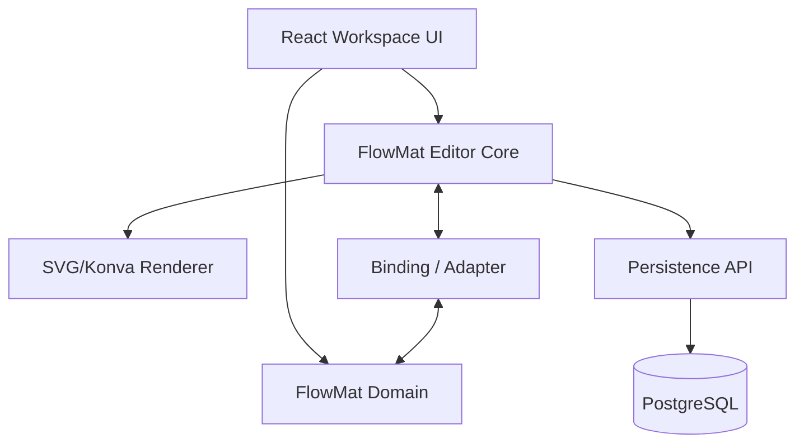
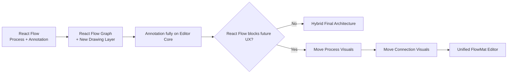
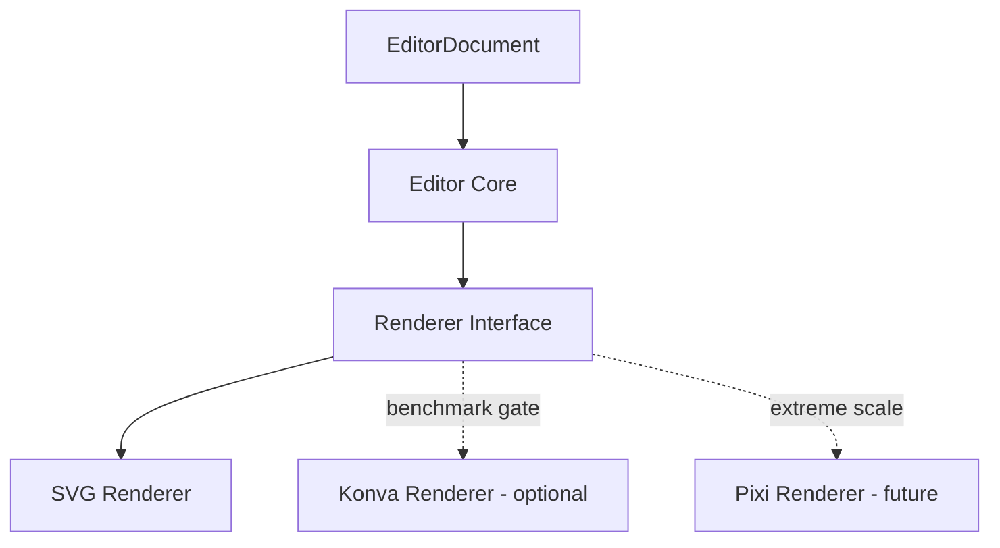
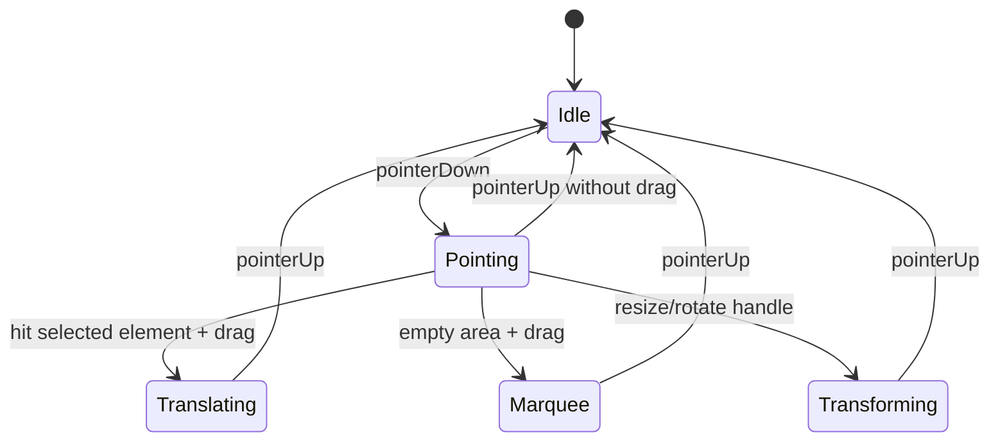
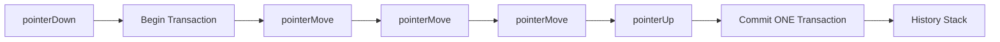

# FlowMat Editor Engine 구현 지시서

> 문서 목적: FlowMat의 기존 React Flow 기반 캔버스를 보존하면서, PPT/Figma 계열의 자유 도형 편집 능력을 점진적으로 확보하기 위한 **실행 가능한 기술 지시서**  
> 기준 저장소: `https://github.com/SeolJhin/FlowMat`  
> 기준 브랜치: `main`  
> 작성 기준일: 2026-08-11  
> 대상: FlowMat 프론트엔드/그래픽 엔진 담당 개발자, 테크리드, 코드리뷰어

---

# 0. 이 문서의 결론

이 프로젝트는 다음 세 극단 중 어느 것도 택하지 않는다.

1. **현재 React Flow에 모든 도형 기능을 계속 덧붙이는 방식**
2. **tldraw / Excalidraw / PPTist를 통째로 제품 핵심으로 채택하는 방식**
3. **브라우저 렌더링 계층부터 모든 것을 맨바닥에서 새로 만드는 방식**

우리가 선택할 전략은 다음과 같다.

> **FlowMat 소유의 `Editor Core`를 새로 만들고, 기존 React Flow 기반 시스템을 유지한 채 Annotation/Shape 계층부터 점진적으로 자체 엔진으로 교체한다.**

즉, 아래와 같은 **Strangler Migration + Own-the-Core** 전략을 따른다.

```text
현재
──────────────────────────────────────────────
React Flow
 ├─ Process Node
 ├─ Process Edge
 ├─ Annotation Shape
 ├─ Text
 ├─ Freehand
 ├─ Selection
 ├─ Resize
 ├─ Camera
 └─ Snap

               ↓ 1단계

React Flow                    FlowMat Editor Core
 ├─ Process Node              ├─ Document
 ├─ Process Edge              ├─ Geometry
 └─ 기존 Annotation Adapter   ├─ Camera
                              ├─ Tool
                              ├─ Selection
                              ├─ History
                              └─ Renderer

               ↓ 2단계

Legacy Graph Layer            New Drawing Layer
 ├─ Process Node              ├─ Rectangle
 ├─ Process Edge              ├─ Ellipse
                              ├─ Polygon
                              ├─ Line
                              ├─ Text
                              └─ Freehand

               ↓ 3단계

React Flow 존치 여부 재평가
 ├─ 방해하지 않음 → Graph 전용으로 유지
 └─ 방해함       → Process Node / Connection도 Editor Core로 이전
```

이 결정에서 가장 중요한 원칙은 하나다.

> **리라이트 자체가 목표가 아니다.  
> FlowMat이 자유로운 시각 편집기와 공정 엔진을 동시에 가지기 위해 필요한 최소한의 Core만 자체 소유한다.**

---

# 1. 왜 지금 이 작업이 필요한가

FlowMat의 제품 방향은 단순한 노드 그래프가 아니다.

기획상 요구는 다음과 같이 확장되어 있다.

```text
ERP
+
공정 설계
+
생산 시뮬레이션
+
다이어그램 툴
+
게임형 UI
```

그리고 편집기 관점의 요구는 다음과 같다.

```text
□ 사각형
○ 원 / 타원
△ 삼각형 / 다각형
─ 선
→ 화살표
✎ 자유그리기
T 텍스트
```

여기에 장기적으로 다음이 붙는다.

```text
도형 겹치기
그룹화
회전
리사이즈
레이어/Z-order
사용자 정의 설비
커스텀 컴포넌트
포트
연결선
컨베이어/파이프/전력선
공정 노드와 그래픽의 연결
```

기획 의도는 특히 다음과 같다.

```text
사용자가 기본 도형을 조합한다.
        ↓
원하는 설비 모양을 만든다.
        ↓
그룹으로 묶는다.
        ↓
"컴포넌트로 저장"한다.
        ↓
내 라이브러리에 등록한다.
        ↓
다른 공정도에서 다시 사용한다.
```

예를 들어 사용자가 Tank를 만든다면:

```text
      ┌──────────────┐
     /                \
    │      TANK        │
    │                  │
     \________________/
          ●      ●
        INPUT  OUTPUT
```

내부적으로는 다음일 수 있다.

```text
Group: Tank
├─ Rectangle
├─ Ellipse
├─ Line
├─ Text
├─ PortVisual(Input)
└─ PortVisual(Output)
```

이 수준으로 가면, `ReactFlow Node 하나 = 도형 하나`라는 사고방식은 장기적으로 부적합하다.

---

# 2. 현재 FlowMat 코드 상태 요약

## 2.1 프론트엔드 주요 기술

현재 `flowmat_frontend/package.json` 기준 주요 의존성은 다음과 같다.

```text
React 19
TypeScript
Vite
@xyflow/react
@dagrejs/dagre
zustand
@stomp/stompjs
@tanstack/react-query
html-to-image
```

이 중 역할을 구분하면:

```text
@xyflow/react
→ 현재 그래프 편집/렌더링

@dagrejs/dagre
→ 자동 레이아웃 알고리즘

zustand
→ 앱/워크스페이스 상태

@stomp/stompjs
→ 실시간 동기화

React Query
→ 서버 상태

html-to-image
→ 현재 DOM 기반 이미지 export
```

이 중 **React Flow만 향후 Drawing Layer와 경계를 재정의할 대상**이다.

Dagre, Zustand, STOMP, React Query를 이 작업 때문에 제거할 이유는 없다.

---

## 2.2 현재 `CanvasViewport.tsx`의 역할

현재 `CanvasViewport.tsx`는 약 1천 LOC가 넘는 대형 컴포넌트이며, 핵심적으로 아래 책임들이 모여 있다.

```text
CanvasViewport
│
├─ React Flow Stage
├─ Process Node
├─ Process Edge
├─ Annotation Node
├─ Tool state
├─ Snap guide 계산
├─ Freehand
├─ Zoom/Pan coordinate
├─ Screen → Flow coordinate
├─ Palette drag/drop
├─ Edge connection
├─ Deletion
├─ Presence
└─ Collaboration-related handlers
```

현재 코드에는 실제로 다음과 같은 구조가 있다.

```ts
const nodeTypes = {
  flowmatNode: CanvasNode,
  annotationNode: CanvasAnnotationNode,
}

const edgeTypes = {
  flowmatEdge: CanvasEdge,
}
```

즉:

```text
Process Node
Annotation Shape
Text
Freehand
```

이 모두 React Flow의 `Node` 개념으로 묶여 있다.

또한 annotation 생성/Freehand/Palette drop 등의 좌표 변환이 다음과 같이 React Flow API에 의존한다.

```text
reactFlowInstance.screenToFlowPosition(...)
```

따라서 현 상태에서 자유 도형 기능을 계속 추가하면 다음과 같은 결합이 심화된다.

```text
Circle          → ReactFlow Node
Triangle        → ReactFlow Node
Line            → ReactFlow Edge 또는 Node
Text            → ReactFlow Node
Custom Shape    → ReactFlow Node
Component       → ReactFlow Node?
Group           → ReactFlow Node?
```

그룹·중첩·회전·커스텀 컴포넌트 단계부터 모델이 억지스러워진다.

---

## 2.3 현재 Annotation 모델은 살릴 가치가 높다

현재 `CanvasAnnotationViewModel`에는 이미 다음 정보가 존재한다.

```text
annotationType
shapeKind
position
size
rotation
points
textContent
style
zIndex
groupId
locked
version
versionNonce
```

현재 shape 종류:

```text
rectangle
ellipse
diamond
```

현재 annotation 종류:

```text
shape
freehand
text
```

이 구조는 새 Editor Core로 이전하기 좋은 기반이다.

따라서 **Backend Annotation API / DTO / DB 모델은 초기 단계에서 변경하지 않는다.**

---

## 2.4 Process/Connection 모델도 그래픽과 분리되어 있다

현재 Process Node ViewModel에는 다음 정보가 있다.

```text
processId
position
size
inputs
outputs
version
```

Connection ViewModel에는 다음이 별도로 있다.

```text
connectionId
source
target
sourceHandle
targetHandle
fromProcessId
toProcessId
fromIoId
toIoId
flowRate
delayTimeSec
lossRate
priority
```

이 점은 향후 매우 중요하다.

왜냐하면:

```text
그래픽 Line
```

과

```text
공정 Connection
```

을 분리할 수 있기 때문이다.

---

# 3. 절대 혼동하지 말아야 할 개념

## 3.1 Shape와 Process Node는 다르다

화면:

```text
┌──────────────┐
│              │
└──────────────┘
```

이것은 그냥 사각형일 수 있다.

```ts
RectangleElement
```

그러나:

```text
┌──────────────┐
│    MIXER     │
│ ●        ●   │
└──────────────┘
```

이것은 공정 `Process`를 시각적으로 표현한 객체일 수 있다.

따라서:

```text
Graphic Element
      ≠
Domain Process
```

이어야 한다.

연결은 Binding으로 한다.

```text
Graphic Visual
      │
      │ binding
      ▼
Domain Process
```

---

## 3.2 Line과 Connection은 다르다

사용자가 그냥 선을 그릴 수 있다.

```text
──────────────
```

이것은:

```ts
LineElement
```

이다.

그런데:

```text
Machine A.out ───────────→ Machine B.in
```

은:

```ts
ProcessConnection
```

이다.

공정 Connection은 단순한 그림이 아니다.

FlowMat에서 Connection은 다음 의미를 가진다.

```text
A의 Output
   ↓
Resource 전달
   ↓
B의 Input
```

따라서 장기적으로:

```text
Connection Domain Model
+
Connection Visual Model
```

을 분리한다.

---

# 4. 벤치마킹 전략

벤치마킹의 목표는 **소스 복제**가 아니다.

다음 네 가지 레포에서 서로 다른 것을 배운다.

| 대상 | 우리가 배울 것 | 직접 종속 여부 |
|---|---|---|
| tldraw | Editor/Tool/Store/Geometry 구조 | 원칙적으로 X |
| Excalidraw | 실제 도형/드래그/선/Scene 알고리즘 | X, 코드 참고 |
| PPTist | PPT 수준 UX, Toolbar/Property Panel | X |
| SVG-Edit | SVG 기반 기본 Vector Editor 구조 | 비교/참고 |

---

# 5. tldraw에서 무엇을 공부할 것인가

tldraw는 FlowMat에 통째로 넣지 않는다.

현재 tldraw SDK는 개발용 사용과 production 사용의 라이선스 조건이 다르고, production SDK 사용에는 라이선스 키가 필요하다. 따라서 핵심 product dependency로 묶는 결정은 하지 않는다.

그러나 구조는 매우 강한 참고 대상이다.

FlowMat 팀의 기존 조사 문서에도 이미 다음 핵심 위치가 정리되어 있다.

```text
Editor.ts
Store.ts
GeoShapeTool.ts
LineShapeTool.ts
ArrowShapeTool.ts
SelectTool / Translating
HandTool / Dragging
ZoomTool
```

우리가 배울 원칙:

```text
Tool owns interaction
Store owns document
Geometry owns geometry
Renderer owns appearance
Editor coordinates them
```

FlowMat 번역:

```text
tldraw                  FlowMat
────────────────────────────────────
Editor              →   FlowMatEditor
Shape Record         →   EditorElement
Tool                 →   EditorTool
Store                →   EditorDocument/Store
Geometry             →   Geometry module
Binding              →   Visual/Domain Binding
Camera               →   CameraManager
```

### 직원 지시

tldraw 코드를 읽을 때 "함수를 가져올 수 있나?"부터 보지 마라.

다음 질문만 적어라.

1. Tool state를 어디에 보관하는가?
2. Pointer down/move/up이 어떤 객체를 통과하는가?
3. Selection과 Shape 데이터가 어떻게 분리되는가?
4. Geometry와 Rendering이 어떻게 분리되는가?
5. Camera가 world/screen 좌표를 어떻게 다루는가?
6. Drag 도중 state와 commit state를 어떻게 나누는가?
7. Shape binding을 어떻게 표현하는가?
8. UI 버튼과 editor command 사이 경계가 어디인가?

---

# 6. Excalidraw에서 무엇을 공부할 것인가

Excalidraw는 MIT 라이선스이며 자유 도형 편집 알고리즘을 연구하기 좋은 기준이다.

특히 봐야 할 영역:

```text
newElement
dragElements
linearElementEditor
Scene
store
zoom
actions
```

배울 것:

```text
요소 생성
요소 이동
선 포인트 편집
장면(Scene) 관리
zoom/pan
action abstraction
undo/redo
export
```

특히 FlowMat의 현재 `canvasActions.ts`에는 이미 Excalidraw action model의 영향을 받은 구조가 존재한다.

그 방향은 살린다.

### 직원 지시

다음 기능을 구현할 때는 Excalidraw를 먼저 읽어라.

```text
Rectangle create
Line drag
Arrow endpoint
Resize
Multi-selection
Marquee
Scene element ordering
Zoom normalized pointer
```

단, Excalidraw의 데이터 모델을 그대로 FlowMat에 복제하지 않는다.

---

# 7. PPTist에서 무엇을 공부할 것인가

PPTist는 Web PowerPoint에 가까운 UI/UX 참고 대상이다.

현재 라이선스는 AGPL-3.0이며 별도 상업 라이선스 정책도 존재하므로, FlowMat의 폐쇄형/상업형 배포 가능성을 고려할 경우 코드 이식은 피한다.

**PPTist에서는 UX만 가져온다.**

연구 대상:

```text
Toolbar
Property Panel
Selection Handle
Resize Handle
Rotation Handle
Layer ordering
Alignment
Copy/Paste
Keyboard shortcuts
Context menu
Text editing UX
Shape style UX
Line style UX
```

예:

```text
┌────────────────────────────────────────────┐
│ Select | □ | ○ | △ | Line | Text | Image │
└────────────────────────────────────────────┘

                    Canvas

              ○────────────○
              │            │
              │   Shape    │
              │            │
              ○────────────○
                    ↻

                              ┌──────────────┐
                              │ Position     │
                              │ X: 120       │
                              │ Y: 240       │
                              │ W: 300       │
                              │ H: 180       │
                              │ Rotation: 0  │
                              │ Fill         │
                              │ Stroke       │
                              └──────────────┘
```

이런 사용자 경험은 FlowMat에서도 강하게 참고한다.

---

# 8. SVG-Edit에서 무엇을 공부할 것인가

SVG-Edit는 MIT 라이선스이며 내부를 크게:

```text
svgcanvas
+
editor UI
```

로 나눈다.

이 구조는 우리가 원하는:

```text
Engine
+
React UI
```

분리와 비교해보기 좋다.

특히 연구 대상:

```text
rect
ellipse
polygon
line
path
transform
selection
SVG serialization
```

---

# 9. 왜 LibreOffice / ONLYOFFICE는 지금 1순위가 아닌가

이들은 훌륭한 레퍼런스지만 지금 필요한 문제보다 너무 크다.

다음 문제를 해결할 때 보는 대상이다.

```text
PPTX OOXML compatibility
Text layout engine
Font shaping
Printing
Complex office document model
Collaboration server
Spreadsheet integration
Presentation master/theme
```

현재 목표:

```text
□ ○ △ ─
그리기
선택
이동
리사이즈
회전
```

에는 과도하다.

---

# 10. 아키텍처 핵심 결정

## 10.1 FlowMat Editor Core는 라이브러리 독립이어야 한다

새 경로:

```text
flowmat_frontend/src/lib/flowmat-editor/
```

권장 이유:

- 단순 page feature가 아님
- 여러 화면에서 재사용 가능
- renderer와 UI보다 하위 계층
- 장기적으로 FlowMat 플랫폼 핵심

---

# 11. 목표 디렉터리 구조

```text
src/
└─ lib/
   └─ flowmat-editor/
      │
      ├─ core/
      │  ├─ Editor.ts
      │  ├─ EditorStore.ts
      │  ├─ EditorSession.ts
      │  └─ EditorEvent.ts
      │
      ├─ model/
      │  ├─ EditorDocument.ts
      │  ├─ EditorElement.ts
      │  ├─ ElementId.ts
      │  ├─ Selection.ts
      │  └─ Camera.ts
      │
      ├─ geometry/
      │  ├─ Vec2.ts
      │  ├─ Box2.ts
      │  ├─ Matrix2D.ts
      │  ├─ Transform.ts
      │  ├─ Bounds.ts
      │  ├─ HitTest.ts
      │  ├─ Polygon.ts
      │  └─ Segment.ts
      │
      ├─ elements/
      │  ├─ RectangleElement.ts
      │  ├─ EllipseElement.ts
      │  ├─ PolygonElement.ts
      │  ├─ LineElement.ts
      │  ├─ FreehandElement.ts
      │  ├─ TextElement.ts
      │  └─ GroupElement.ts
      │
      ├─ tools/
      │  ├─ Tool.ts
      │  ├─ SelectTool.ts
      │  ├─ PanTool.ts
      │  ├─ RectangleTool.ts
      │  ├─ EllipseTool.ts
      │  ├─ PolygonTool.ts
      │  ├─ LineTool.ts
      │  ├─ FreehandTool.ts
      │  └─ TextTool.ts
      │
      ├─ selection/
      │  └─ SelectionManager.ts
      │
      ├─ camera/
      │  └─ CameraManager.ts
      │
      ├─ snapping/
      │  └─ SnapManager.ts
      │
      ├─ history/
      │  ├─ Transaction.ts
      │  └─ HistoryManager.ts
      │
      ├─ commands/
      │  ├─ createElement.ts
      │  ├─ updateElement.ts
      │  ├─ deleteElements.ts
      │  ├─ duplicateElements.ts
      │  ├─ groupElements.ts
      │  ├─ ungroupElements.ts
      │  ├─ bringForward.ts
      │  └─ sendBackward.ts
      │
      └─ index.ts
```

---

# 12. Editor Core의 금지 import

`flowmat-editor` 내부에서는 다음을 직접 import하지 않는다.

```text
React
React DOM
@xyflow/react
zustand
axios
React Query
Spring API
workflowApi
STOMP
html-to-image
Konva
Pixi
```

즉 다음이 가능해야 한다.

```ts
const editor = new Editor(document)

editor.createElement(...)
editor.select(...)
editor.moveSelection(...)
editor.resizeSelection(...)
editor.rotateSelection(...)
editor.undo()
editor.redo()
```

React가 없어도 unit test에서 실행 가능해야 한다.

---

# 13. Source of Truth

가장 중요한 질문:

> 화면이 정답인가, 데이터가 정답인가?

정답:

> **EditorDocument가 정답이다.**

다음은 금지한다.

```text
DOM position이 원본 데이터
SVG Element가 원본 데이터
Konva.Rect 객체가 원본 데이터
React Flow Node 객체가 원본 데이터
```

올바른 구조:

```text
EditorDocument
      ↓
Renderer
      ↓
DOM / SVG / Canvas
```

---

# 14. BaseElement 설계

예시:

```ts
export type ElementId = string

export interface BaseElement {
  id: ElementId

  type: string

  x: number
  y: number

  width: number
  height: number

  rotation: number

  opacity: number

  parentId: ElementId | null

  locked: boolean
  hidden: boolean

  order: number
}
```

주의:

- `x`, `y`는 world coordinate
- `rotation`은 degree 또는 radian 중 하나를 프로젝트 전체에서 통일
- `order` 또는 별도 root order로 z-order 관리
- renderer 전용 속성은 넣지 않는다

---

# 15. Style 모델

```ts
export interface ShapeStyle {
  fill: string
  stroke: string
  strokeWidth: number

  strokeStyle:
    | 'solid'
    | 'dashed'
    | 'dotted'

  opacity: number
}
```

Line:

```ts
export interface LineStyle {
  stroke: string
  strokeWidth: number
  strokeStyle:
    | 'solid'
    | 'dashed'
    | 'dotted'
  opacity: number
}
```

---

# 16. Rectangle

```ts
export interface RectangleElement extends BaseElement {
  type: 'rectangle'
  cornerRadius: number
  style: ShapeStyle
}
```

---

# 17. Ellipse

```ts
export interface EllipseElement extends BaseElement {
  type: 'ellipse'
  style: ShapeStyle
}
```

---

# 18. 삼각형을 별도 타입으로 만들지 않는다

이것은 중요한 지시다.

금지:

```text
TriangleElement
PentagonElement
HexagonElement
OctagonElement
```

대신:

```ts
export interface PolygonElement extends BaseElement {
  type: 'polygon'
  points: Vec2[]
  style: ShapeStyle
}
```

삼각형 Tool은 Polygon을 생성한다.

```text
Triangle Tool
    ↓
PolygonElement
points = 3
```

향후:

```text
Pentagon
Hexagon
Star
Custom Polygon
```

도 같은 모델로 처리할 수 있다.

---

# 19. Line

```ts
export interface LineElement extends BaseElement {
  type: 'line'

  points: Vec2[]

  startDecoration:
    | 'none'
    | 'arrow'

  endDecoration:
    | 'none'
    | 'arrow'

  style: LineStyle
}
```

v1에서는 2 point line으로 시작해도 된다.

```text
P0 ●────────────● P1
```

향후:

```text
Polyline
Orthogonal
Bezier
```

를 추가할 수 있도록 `points[]`를 사용한다.

---

# 20. Freehand

```ts
export interface FreehandElement extends BaseElement {
  type: 'freehand'

  points: Vec2[]

  style: LineStyle
}
```

Freehand raw point는 너무 많아질 수 있으므로 추후:

```text
sampling
simplification
smoothing
```

을 추가한다.

v1에서 premature optimization은 금지.

---

# 21. Text

Text는 v1 후반에 구현한다.

```ts
export interface TextElement extends BaseElement {
  type: 'text'

  text: string

  style: {
    color: string
    fontSize: number
    fontWeight: number
    textAlign: 'left' | 'center' | 'right'
  }
}
```

Text layout engine을 직접 만들지는 않는다.

브라우저 text rendering을 사용한다.

---

# 22. Group

```ts
export interface GroupElement extends BaseElement {
  type: 'group'
  children: ElementId[]
}
```

Scene:

```text
Group: MixerAppearance
│
├─ Rectangle
├─ Ellipse
├─ Polygon
├─ Line
└─ Text
```

그룹에 필요한 기능:

```text
move
resize
rotate
duplicate
delete
bring forward
send backward
ungroup
```

---

# 23. Scene Graph

Document:

```ts
export interface EditorDocument {
  id: string

  elements: Record<ElementId, EditorElement>

  rootOrder: ElementId[]
}
```

구조:

```text
EditorDocument
│
├─ rootOrder
│   ├─ shape-1
│   ├─ group-1
│   └─ line-9
│
└─ elements
    ├─ shape-1
    ├─ group-1
    │   ├─ shape-2
    │   └─ text-1
    └─ line-9
```

---

# 24. Scene과 Overlay는 분리한다

절대 selection handle을 document에 넣지 않는다.

```text
Scene Layer
────────────────────────
Rectangle
Ellipse
Polygon
Line
Text
Freehand
Group

Overlay Layer
────────────────────────
Selection Box
Resize Handles
Rotation Handle
Marquee
Snap Guides
Hover Highlight
Remote Cursor
Tool Preview
```

ASCII:

```text
             Overlay
       ○────────────○
       │            │
       │   Scene    │
       │   Shape    │
       │            │
       ○────────────○
             ↻
```

저 `○`, `↻`는 데이터가 아니다.

---

# 25. Camera

Camera는 Editor Core 안에 둔다.

```ts
export interface Camera {
  x: number
  y: number
  zoom: number
}
```

좌표 체계:

```text
World Coordinate
      ↓
Camera Transform
      ↓
Screen Coordinate
```

공식:

```text
screenX = worldX * zoom + cameraX
screenY = worldY * zoom + cameraY
```

역변환:

```text
worldX = (screenX - cameraX) / zoom
worldY = (screenY - cameraY) / zoom
```

함수:

```ts
worldToScreen(point: Vec2): Vec2
screenToWorld(point: Vec2): Vec2
```

---

# 26. 현재 React Flow 좌표 의존 제거

현재 사용:

```text
reactFlowInstance.screenToFlowPosition(...)
```

새 구조:

```text
editor.camera.screenToWorld(...)
```

Migration 기간:

```text
React Flow camera
      ↓ adapter
Editor Camera
```

가능한 한 빠르게 좌표 변환의 source of truth를 분리한다.

---

# 27. Tool 시스템

v1에서는 간단한 인터페이스를 사용한다.

```ts
export interface EditorTool {
  id: string

  onPointerDown?(event: EditorPointerEvent): void
  onPointerMove?(event: EditorPointerEvent): void
  onPointerUp?(event: EditorPointerEvent): void

  onKeyDown?(event: EditorKeyEvent): void

  cancel?(): void
}
```

---

# 28. Pointer Event 정규화

브라우저 event를 Core로 직접 넘기지 않는다.

```ts
export interface EditorPointerEvent {
  screen: Vec2
  world: Vec2

  button: number

  shiftKey: boolean
  ctrlKey: boolean
  metaKey: boolean
  altKey: boolean
}
```

React Adapter:

```text
Browser PointerEvent
      ↓
normalize
      ↓
EditorPointerEvent
```

---

# 29. Rectangle Tool 상태

```text
┌──────┐
│ Idle │
└──┬───┘
   │ pointerDown
   ▼
┌─────────┐
│ Drawing │
└──┬──────┘
   │ pointerMove
   ├────────→ Preview update
   │
   │ pointerUp
   ▼
┌────────┐
│ Commit │
└──┬─────┘
   ▼
 Select
```

행동:

1. pointerDown world 좌표 저장
2. preview element 생성
3. pointerMove마다 bounds 계산
4. pointerUp 시 document에 commit
5. 새 element 선택
6. tool 정책에 따라 select로 복귀

---

# 30. Ellipse Tool

Rectangle과 동일한 bounding box 방식.

```text
start ●──────────────┐
      │              │
      │      ○       │
      │              │
      └──────────────● current
```

---

# 31. Polygon / Triangle Tool

v1 Triangle은 drag bounding box로 생성 가능하다.

```text
       ●
      / \
     /   \
    /     \
   ●───────●
```

points는 local coordinate로 저장하는 것을 권장한다.

예:

```ts
[
  { x: 0.5, y: 0 },
  { x: 1,   y: 1 },
  { x: 0,   y: 1 },
]
```

정규화 좌표 또는 element local coordinate 중 하나를 선택하고 문서 전체에서 통일한다.

---

# 32. Select Tool 상태 머신

```text
                    ┌───────────┐
                    │   Idle    │
                    └─────┬─────┘
                          │
             pointerDown  │
           ┌──────────────┼──────────────┐
           │              │              │
           ▼              ▼              ▼
       On Shape       On Empty      On Handle
           │              │              │
           ▼              ▼              ▼
      Translating       Marquee      Transforming
           │              │              │
           └──────────────┴──────────────┘
                          │
                       pointerUp
                          ▼
                         Idle
```

---

# 33. Selection State

```ts
export interface SelectionState {
  ids: Set<ElementId>
}
```

규칙:

```text
Click
→ single selection

Shift + Click
→ toggle

Empty Click
→ clear

Drag Empty
→ marquee

Ctrl/Cmd + A
→ editable elements 전체 선택

Escape
→ clear
```

---

# 34. Hit Testing

## 34.1 Rectangle

rotation이 없을 때:

```text
x <= px <= x + width
y <= py <= y + height
```

rotation이 있으면 pointer를 inverse transform해 local coordinate에서 검사한다.

```text
World Pointer
     ↓ inverse matrix
Local Pointer
     ↓
Axis-aligned hit test
```

이 전략을 기본으로 한다.

---

## 34.2 Ellipse

local coordinate 기준:

```text
((px - cx) / rx)^2
+
((py - cy) / ry)^2
<= 1
```

---

## 34.3 Polygon

point-in-polygon.

Ray casting 또는 winding 방식 중 하나 선택.

---

## 34.4 Line

pointer와 line segment의 최소 거리를 구한다.

```text
Pointer P

        P
        ●
        │ d
A ●─────┼────────● B
```

```text
d <= hitTolerance
```

이면 hit.

중요:

```text
worldTolerance = screenTolerance / zoom
```

예:

```text
screen tolerance = 6px
zoom = 0.25

world tolerance = 24
```

그래야 zoom out 상태에서도 선 클릭이 가능하다.

---

# 35. Geometry Module

필수 타입:

```ts
type Vec2 = {
  x: number
  y: number
}

type Box2 = {
  minX: number
  minY: number
  maxX: number
  maxY: number
}
```

필수 함수:

```text
add
subtract
distance
dot
normalize
rotate
pointInPolygon
distancePointToSegment
boundsFromPoints
transformPoint
inverseTransformPoint
```

---

# 36. Matrix2D

Group/Rotate를 할 계획이면 반드시 만든다.

최소 기능:

```text
identity
translate
scale
rotate
multiply
inverse
transformPoint
```

구조:

```text
Local Shape
   ↓ Local Transform
Group
   ↓ Parent Transform
World
   ↓ Camera Transform
Screen
```

---

# 37. Translate

드래그 중 매 move event마다 history를 push하면 안 된다.

올바른 흐름:

```text
pointerDown
↓
snapshot selection initial position
↓
begin transaction
↓
pointerMove
↓
preview/update
↓
pointerMove
↓
preview/update
↓
pointerUp
↓
commit transaction ONE TIME
```

---

# 38. Resize

기본 handle:

```text
NW      N      NE
○───────○───────○
│               │
│               │
○ W           E ○
│               │
│               │
○───────○───────○
SW      S      SE
```

v1:

```text
8 directional handles
```

필수 modifier:

```text
Shift
→ aspect ratio lock

Alt
→ center resize
```

이 둘은 v1.1로 미뤄도 되지만 인터페이스는 고려한다.

---

# 39. Rotate

```text
       ○  ← rotation handle
       │
       │
○──────○──────○
│             │
│    Shape    │
│             │
○─────────────○
```

rotation은 중심 기준.

```text
angle =
atan2(pointer.y - center.y,
      pointer.x - center.x)
```

Snapping:

```text
Shift
→ 15° increment
```

v1.1.

---

# 40. Snap Engine

현재 `CanvasViewport.tsx`에 이미 left/center/right, top/middle/bottom 기반 snap guide 로직이 존재한다.

이 알고리즘을 버리지 않는다.

**React 컴포넌트 밖으로 추출한다.**

기존:

```text
CanvasViewport
 └ calculateSnapGuides
```

신규:

```text
flowmat-editor
 └ snapping
    └ SnapManager
```

Candidate:

```ts
export interface SnapCandidate {
  axis: 'x' | 'y'
  source: number
  target: number
  distance: number
}
```

비교:

```text
Dragging:
left
center
right
top
middle
bottom

Other:
left
center
right
top
middle
bottom
```

---

# 41. Snap Guide는 Overlay다

```text
     │
     │ guide
┌────┼──────┐
│    │      │
│ Shape A   │
└───────────┘

     │
┌────┼──────┐
│    │      │
│ Shape B   │
└───────────┘
```

저 guide는 document에 저장하지 않는다.

---

# 42. History

현재 `commandHistory.ts`의 Command 개념은 유지 가치가 있다.

그러나 Editor 내부 History는 서버 mutation 중심이 아니라 **local transaction 중심**으로 새로 만든다.

예:

```ts
export interface EditorPatch {
  elementId: ElementId

  before: EditorElement | null
  after: EditorElement | null
}
```

Transaction:

```ts
export interface EditorTransaction {
  id: string
  label: string
  patches: EditorPatch[]
  timestamp: number
}
```

---

# 43. History 예시

사용자가 사각형을 200px 움직인다.

실제 pointer event:

```text
move +2
move +4
move +3
move +8
move +10
...
```

History:

```text
Move Selection
```

단 하나.

Undo:

```text
after → before
```

Redo:

```text
before → after
```

---

# 44. Persistence는 History와 분리

잘못된 구조:

```text
undo
↓
REST DELETE
↓
REST CREATE
```

이것이 Editor Core의 기본이 되면 안 된다.

올바른 구조:

```text
User Interaction
      ↓
Editor Transaction
      ↓
Local Document
      ↓
Persistence Adapter
      ↓
Backend
```

Undo:

```text
History rollback
      ↓
Local Document
      ↓
Persistence sync
```

---

# 45. Action 시스템

현재 `canvasActions.ts`에서 가져갈 아이디어:

```text
Toolbar
Keyboard Shortcut
Context Menu
```

가 동일 Action을 호출한다.

Core Action:

```text
deleteSelection
duplicateSelection
selectAll
undo
redo
group
ungroup
bringForward
sendBackward
```

Workspace Domain Action:

```text
deleteProcess
editResource
runSimulation
editConnection
```

혼합하지 않는다.

---

# 46. Renderer 전략

## 결정

**Renderer v1은 SVG를 우선 구현한다.**

이유:

1. 현재 요구는 기본 vector shape 중심
2. React와 결합하기 쉬움
3. DOM/SVG debugging이 쉽다
4. hit overlay/selection 시각화가 단순
5. SVG export가 자연스럽다
6. 현재 Freehand/Snap overlay에서도 이미 SVG 경험이 있다

---

# 47. Renderer는 Core와 분리

예:

```text
Editor Core
    ↓
Renderer Adapter
    ↓
SVG
```

향후:

```text
Editor Core
    ├→ SVG Renderer
    ├→ Konva Renderer
    └→ Pixi Renderer
```

가능해야 한다.

---

# 48. React Render 구조

```text
EditorCanvas
│
├─ SvgScene
│  ├─ RectangleView
│  ├─ EllipseView
│  ├─ PolygonView
│  ├─ LineView
│  ├─ FreehandView
│  └─ TextView
│
└─ EditorOverlay
   ├─ SelectionBounds
   ├─ ResizeHandles
   ├─ RotationHandle
   ├─ MarqueeRect
   └─ SnapGuides
```

---

# 49. SVG Renderer 예시

```text
<svg>
  <g transform="camera">
    <g id="scene">
      <rect />
      <ellipse />
      <polygon />
      <line />
    </g>

    <g id="overlay">
      selection
      handles
      guides
    </g>
  </g>
</svg>
```

단, Overlay 일부는 camera scaling과 독립적인 screen pixel 크기가 필요할 수 있다.

예:

```text
Resize handle = 항상 8px
```

Zoom 20%에서도 1.6px로 작아지면 안 된다.

따라서 selection overlay는 world/screen 변환을 고려하여 구현한다.

---

# 50. Konva는 언제 검토할 것인가

지금 즉시 production dependency로 박지 않는다.

먼저 동일 Editor Core로 성능 벤치마크를 만든다.

Scene:

```text
100 elements
1,000 elements
5,000 elements
10,000 elements
```

테스트:

```text
Pan
Zoom
Single drag
Multi-selection drag
Marquee
Resize
Hover
```

측정:

```text
frame time
input latency
memory
DOM node count
```

SVG가 목표 범위에서 충분하면 유지.

부족할 경우:

```text
SVG Renderer
     ↓
Konva Renderer
```

교체한다.

Core는 변경하지 않는다.

---

# 51. Renderer Benchmark Gate

다음 기준을 제품 요구에 맞게 확정하라.

초기 제안:

```text
1,000 object scene
→ drag 체감 지연 없음

5,000 simple objects
→ pan/zoom usable

10,000 objects
→ degraded mode 허용
```

정확한 ms 목표는 팀 환경에서 프로파일링 후 확정한다.

---

# 52. 첫 Migration 대상: Annotation

**Process Node를 먼저 건드리지 않는다.**

현재 `WorkflowCanvasViewModel`은:

```text
nodes
edges
annotations
```

를 분리한다.

이 구조를 이용한다.

현재:

```text
React Flow
├─ Process Node
├─ Annotation Node
└─ Process Edge
```

1차 목표:

```text
Workspace
│
├─ Drawing Layer       ← FlowMat Editor
│  ├─ Shape
│  ├─ Text
│  └─ Freehand
│
└─ Graph Layer         ← React Flow
   ├─ Process Node
   └─ Process Edge
```

---

# 53. 왜 Annotation부터인가

이유:

1. Domain side effect가 상대적으로 적다
2. 기존 DTO가 이미 shape/text/freehand로 분리
3. rotation/zIndex/groupId가 이미 존재
4. Process I/O Handle을 건드리지 않아도 된다
5. React Flow와 신규 엔진 parity를 비교하기 좋다
6. Rollback이 쉽다

---

# 54. Adapter

```text
CanvasAnnotationViewModel
      ↓
AnnotationEditorAdapter
      ↓
EditorElement
```

예:

```text
shape + rectangle
→ RectangleElement

shape + ellipse
→ EllipseElement

shape + diamond
→ PolygonElement

freehand
→ FreehandElement

text
→ TextElement
```

---

# 55. Backend를 초기에는 바꾸지 않는다

```text
EditorElement
      ↓
Persistence Adapter
      ↓
기존 Annotation REST API
      ↓
기존 Backend/DB
```

즉:

```text
새 Front Editor
+
기존 Persistence
```

로 migration한다.

---

# 56. Dual Layer 구조 주의

React Flow와 SVG Drawing Layer를 겹칠 경우:

```text
┌──────────────────────── Workspace ────────────────────────┐
│                                                           │
│  Drawing Layer (SVG)                                      │
│       □ ○ △ ─                                             │
│                                                           │
│  Graph Layer (React Flow)                                 │
│       [Process] ───────── [Process]                       │
│                                                           │
└───────────────────────────────────────────────────────────┘
```

문제:

```text
pointer ownership
z-index
camera sync
selection ownership
keyboard shortcuts
```

따라서 초기에 Interaction Router가 필요하다.

---

# 57. Interaction Router

예:

```text
activeTool = rectangle
→ Drawing Layer가 pointer 소유

activeTool = ellipse
→ Drawing Layer

activeTool = select
→ hit test 결과에 따라 결정

activeTool = connect
→ Graph Layer
```

장기적으로 Editor가 workspace pointer source of truth가 되어야 한다.

---

# 58. Camera 동기화

Migration 중 가장 어려운 부분 중 하나.

초기에는:

```text
React Flow viewport
      ↓ onMove
Editor Camera update
```

또는 반대.

**양방향 무한 동기화는 금지.**

하나를 owner로 정한다.

초기 migration 동안:

```text
React Flow = viewport owner
Editor Drawing Layer = follower
```

로 두는 것이 안전하다.

최종적으로 process node까지 이전할 경우:

```text
Editor Camera = owner
```

로 바꾼다.

---

# 59. 기존 `CanvasAnnotationNode.tsx`

현재 이 컴포넌트는:

```text
NodeProps
NodeResizer
NodeToolbar
React Flow selected state
CSS shape
SVG freehand
```

에 강하게 의존한다.

따라서 Annotation migration 완료 시 **제거 대상으로 본다.**

단 삭제 조건:

- Shape create parity
- Move parity
- Resize parity
- Text parity
- Freehand parity
- Delete parity
- Persistence parity
- Realtime refresh parity

모두 통과 후 삭제.

---

# 60. React Flow를 언제 제거할 것인가

미리 결정하지 않는다.

Drawing v1 안정화 후 Gate를 통과해야 한다.

## React Flow 유지 조건

다음이 모두 가능하면 유지한다.

```text
Drawing Shape와 Process Node가 동일 캔버스에서 문제없이 공존
Process Node 회전 필요 없음
Shape+Process 혼합 Group 필요 없음
Global z-order 혼합 필요 없음
Component 내부 Domain Node embedding 필요 없음
Selection UX가 충분히 통합 가능
```

이 경우:

```text
FlowMat Workspace
├─ FlowMat Drawing Engine
└─ React Flow Graph Engine
```

영구 공존 가능.

---

# 61. React Flow 제거 Gate

다음 중 실제 product requirement가 생기면 migration을 검토한다.

```text
Shape + Process Node를 하나의 Group으로 묶어야 한다
모든 객체를 동일 SceneGraph에서 z-order 해야 한다
Process Node도 자유 회전해야 한다
Component 내부에 Process Node를 포함해야 한다
Connection routing을 완전히 커스텀해야 한다
React Flow camera/selection이 새 Editor의 UX를 방해한다
성능 병목이 React Flow layer에서 발생한다
```

이때만 Process Node migration Phase를 시작한다.

---

# 62. Process Node migration 설계

최종 모델 예:

```ts
export interface DomainVisualElement extends BaseElement {
  type: 'domain-visual'

  binding: {
    domain: 'process'
    id: string
  }

  visualDefinitionId?: string
}
```

도메인:

```text
Process P01
├─ inputs
├─ outputs
├─ duration
└─ rules
```

시각 요소:

```text
Visual V01
├─ x/y
├─ width/height
├─ rotation
├─ component appearance
└─ binding → P01
```

---

# 63. Mixer 예

Domain:

```text
Process P01
Name: Mixer
Inputs:
- Water
- Powder
Outputs:
- Mixed Product
Duration: 10s
```

Visual:

```text
        WATER
          ●
          │
   ┌──────▼──────┐
   │             │
   │    MIXER    │
   │             │
   └──────┬──────┘
          │
          ●
       PRODUCT
```

이 visual을 Rectangle 하나로 표현할 수도 있고, 사용자 Component로 표현할 수도 있다.

---

# 64. Port 모델

장기 모델:

```ts
export interface VisualPort {
  id: string

  ownerVisualId: string

  direction:
    | 'input'
    | 'output'
    | 'bidirectional'

  localPosition: Vec2

  domainIoId?: string
}
```

---

# 65. Connection Visual

```ts
export interface ConnectionVisual {
  id: string

  domainConnectionId?: string

  sourcePortId: string
  targetPortId: string

  routing:
    | 'straight'
    | 'orthogonal'
    | 'bezier'

  appearance:
    | 'line'
    | 'arrow'
    | 'pipe'
    | 'conveyor'
    | 'cable'
}
```

---

# 66. 컨베이어는 별도 Domain이 아닐 수도 있다

시각 표현:

```text
═══════════════════════>
```

내부:

```text
ProcessConnection
+
ConnectionVisual.appearance = conveyor
```

가능.

단, 컨베이어 자체가 capacity/속도/고장 등 실제 설비 의미를 가진다면 별도 Process/Transport domain 객체로 승격할 수 있다.

이 결정은 Drawing Engine에서 하지 않는다.

---

# 67. Dagre

**유지한다.**

Dagre는 React Flow가 아니라 layout algorithm이다.

따라서:

```text
Process Graph
      ↓
Dagre
      ↓
Calculated Position
      ↓
Editor Visual Position
```

로 사용할 수 있다.

React Flow 제거 여부와 무관하다.

---

# 68. Zustand

유지 가능.

단:

```text
Editor Geometry
Editor Document
Tool
HitTest
```

가 Zustand를 필수 import해서는 안 된다.

권장:

```text
App UI state
→ Zustand

Editor Core
→ Plain TypeScript

React Adapter
→ Editor snapshot을 구독
```

---

# 69. Collaboration

현재 STOMP 기반 sync/presence 자산은 유지한다.

지금 Yjs/CRDT로 갈아엎지 않는다.

순서:

```text
Editor Document
↓
Transaction
↓
Persistence
↓
Realtime Sync
↓
필요 시 CRDT
```

협업 기술을 먼저 정하면 Editor 모델이 동기화 기술에 끌려간다.

---

# 70. Remote Presence

Scene 데이터와 분리.

```text
Document
→ persistent

Presence
→ ephemeral
```

Presence:

```text
Remote Cursor
Remote Selection
Freehand in-progress
User editing indicator
```

DB 저장 금지.

---

# 71. Export

현재 `html-to-image`로 React Flow DOM을 캡처하는 방식은 장기적으로 React Flow 종속이다.

향후:

```text
EditorDocument
      ↓
Export Service
      ├─ SVG
      ├─ PNG
      └─ PDF
```

SVG Renderer를 이용하면 첫 export는 SVG가 자연스럽다.

PNG:

```text
SVG
↓ rasterize
PNG
```

---

# 72. PPTX Export는 별도 계층

PptxGenJS는 Editor Core에 넣지 않는다.

```text
EditorDocument
      ↓
Pptx Export Adapter
      ↓
PptxGenJS
      ↓
.pptx
```

이것은 미래 기능.

---

# 73. CAD Import도 별도 계층

DWG parser를 Editor Core에 넣지 않는다.

권장:

```text
DWG/DXF
   ↓
Converter
   ↓
Normalized Vector
   ↓
EditorElement
```

또는:

```text
CAD
↓
SVG
↓
SVG Importer
↓
FlowMat EditorElement
```

---

# 74. Component System

Drawing v1 이후 구현.

사용자:

```text
Rectangle
+
Ellipse
+
Line
+
Text
```

선택:

```text
Ctrl/Cmd + G
```

결과:

```text
Group
```

다음:

```text
Save as Component
```

결과:

```ts
export interface ComponentDefinition {
  id: string
  name: string
  version: number
  rootElements: SerializedEditorElement[]
}
```

배치:

```ts
export interface ComponentInstance {
  definitionId: string
  instanceId: string
}
```

---

# 75. Component Definition / Instance를 분리해야 하는 이유

사용자 라이브러리에 Tank를 저장한다.

```text
Tank Definition v1
        │
        ├─ Instance A
        ├─ Instance B
        └─ Instance C
```

나중에 Definition을 수정했을 때:

```text
모든 instance update
```

또는:

```text
detached instance
```

같은 기능을 구현 가능.

처음부터 단순 Group 복사본만 저장하면 이 기능 확장이 어렵다.

---

# 76. 작업 순서 전체

```text
Phase 0
현행 동결

Phase 1
Editor Core Skeleton

Phase 2
Geometry + Camera

Phase 3
Rectangle / Ellipse / Polygon / Line

Phase 4
Selection / Hit Test

Phase 5
Move / Resize / Rotate

Phase 6
History / Actions

Phase 7
SVG Renderer

Phase 8
Annotation Adapter

Phase 9
Dual Layer Integration

Phase 10
Annotation ReactFlow 제거

Phase 11
Group / Z-order / Component

Phase 12
Performance Benchmark

Phase 13
React Flow Retention Gate

Phase 14
필요 시 Process/Connection Migration
```

---

# 77. Phase 0 — 현행 동결

## 지시

`CanvasViewport.tsx`에 새로운 Drawing feature를 추가하지 않는다.

허용:

```text
bug fix
security fix
migration support
logging
test
```

금지:

```text
새 shape
새 group
새 rotate
새 layer
새 vector feature
새 component system
```

---

# 78. Phase 1 — Editor Core Skeleton

### Ticket E-001

**목적:** renderer 독립 Editor 모델 생성.

산출물:

```text
Editor.ts
EditorDocument.ts
EditorElement.ts
ElementId.ts
```

완료 조건:

- React import 0
- React Flow import 0
- element create/read/update/delete unit test
- serialize/deserialize 가능

---

# 79. Ticket E-002 — Geometry primitives

산출물:

```text
Vec2
Box2
Matrix2D
Segment
Polygon
```

테스트:

```text
matrix inverse
rotate point
point in polygon
distance point to segment
bounds
```

---

# 80. Ticket E-003 — Camera

완료 조건:

```text
screenToWorld(worldToScreen(p)) ≈ p
```

zoom:

```text
min zoom
max zoom
zoom around cursor
```

테스트.

---

# 81. Ticket E-004 — Rectangle

완료 조건:

1. Drag 생성
2. 최소 크기 처리
3. 역방향 drag 처리
4. document 저장
5. renderer 표시
6. reload 후 동일

---

# 82. 역방향 Drag 중요

사용자가 오른쪽 아래 → 왼쪽 위로 그릴 수 있다.

```text
Current ●────────────┐
        │            │
        │            │
        └────────────● Start
```

bounds normalize:

```text
minX
minY
maxX
maxY
```

로 처리.

---

# 83. Ticket E-005 — Ellipse

Rectangle Tool infrastructure 재사용.

복붙 구현 금지.

공통:

```text
DragShapeToolBase
```

추상화는 **2개 이상 실제 중복이 발생한 뒤** 도입한다.

처음부터 과도한 framework를 만들지 않는다.

---

# 84. Ticket E-006 — Polygon / Triangle

완료 조건:

```text
triangle creation
selection
move
resize
rotate 준비
```

---

# 85. Ticket E-007 — Line

완료 조건:

```text
start endpoint
end endpoint
hit test
move whole line
move endpoint
```

v1에서 endpoint handle 제공 가능.

---

# 86. Ticket E-008 — Selection

완료 조건:

```text
click select
shift toggle
empty clear
marquee
Ctrl/Cmd+A
Escape
```

---

# 87. Ticket E-009 — Translate

완료 조건:

- single selection
- multi selection
- 1 drag = 1 history transaction
- zoom level 무관 world delta 정확

---

# 88. Ticket E-010 — Resize

완료 조건:

```text
8 handles
minimum size
rotation 0° 정확
multi selection은 후순위 가능
```

Rotation이 있는 shape resize는 E-011과 함께 검증.

---

# 89. Ticket E-011 — Rotate

완료 조건:

```text
center rotation
rotation handle
hit test with inverse transform
selection bounds update
```

---

# 90. Ticket E-012 — Snap

기존 `calculateSnapGuides` 알고리즘을 분석하여 Core로 옮긴다.

완료 조건:

```text
left-center-right
top-middle-bottom
```

guide overlay 표시.

---

# 91. Ticket E-013 — History

완료 조건:

```text
create undo/redo
move undo/redo
resize undo/redo
rotate undo/redo
delete undo/redo
```

100번 연속 undo/redo test.

---

# 92. Ticket E-014 — SVG Renderer

완료 조건:

```text
Rectangle
Ellipse
Polygon
Line
```

렌더링.

Renderer에서 business domain import 금지.

---

# 93. Ticket E-015 — Annotation Adapter

입력:

```text
CanvasAnnotationViewModel
```

출력:

```text
EditorElement
```

양방향 변환:

```text
Annotation → Editor
Editor → Annotation mutation
```

---

# 94. Ticket E-016 — Dual Layer

기존 React Flow Graph와 신규 SVG Drawing Layer를 같은 Workspace에 겹친다.

완료 조건:

```text
Pan sync
Zoom sync
No offset
No scale mismatch
Pointer ownership correct
```

---

# 95. Ticket E-017 — Annotation parity

기존 annotation 기능과 비교한다.

체크:

```text
Rectangle
Ellipse
Diamond
Text
Freehand
Move
Resize
Delete
Save
Reload
Realtime refresh
```

완전 parity 후 다음 단계.

---

# 96. Ticket E-018 — Legacy Annotation 제거

삭제 후보:

```text
CanvasAnnotationNode.tsx
```

또는 역할 축소.

삭제 전 git diff와 테스트 보고서 필수.

---

# 97. Ticket E-019 — Group

완료 조건:

```text
group
ungroup
group move
group rotate
group resize
nested group 정책
```

Nested group은 v1에서는 제한해도 된다.

---

# 98. Ticket E-020 — Z-order

기능:

```text
Bring to Front
Bring Forward
Send Backward
Send to Back
```

Document order와 UI layer panel 일치.

---

# 99. Ticket E-021 — Component prototype

목적:

```text
Group
↓
Save Component
↓
Library
↓
Place Instance
```

Backend 저장은 별도 Phase로 미뤄도 됨.

---

# 100. 테스트 전략

## Unit Test

대상:

```text
Vec2
Matrix2D
Box2
HitTest
Polygon
Line distance
Camera
Snap
History
Document serialization
```

---

# 101. Interaction Test

시나리오:

```text
draw rectangle
select
move
undo
redo

draw ellipse
resize
rotate
reload

draw line
endpoint edit

marquee 3 shapes
move all
undo
```

---

# 102. Coordinate Regression Test

아주 중요.

각 zoom:

```text
25%
50%
100%
200%
400%
```

에서:

```text
draw
move
resize
line hit
snap
```

동일하게 동작해야 한다.

---

# 103. Rotation Regression

각 angle:

```text
0
15
45
90
135
180
270
```

에서:

```text
hit
move
resize
selection bounds
```

검증.

---

# 104. Persistence Test

```text
Create
↓
Save
↓
Refresh
↓
Load
```

결과가 동일.

비교 항목:

```text
position
size
rotation
style
z-order
group
points
```

---

# 105. Performance Test

Scene 생성 script를 만든다.

```text
100
1,000
5,000
10,000
```

simple rectangles.

측정:

```text
initial render
pan
zoom
drag
marquee
memory
```

---

# 106. Product UX Test

PPT/Figma 기준의 감각을 테스트한다.

질문:

1. 선택 핸들이 너무 크거나 작은가?
2. 25% zoom에서 line 클릭 가능한가?
3. resize cursor 방향이 rotation에 맞는가?
4. empty space pan이 자연스러운가?
5. delete 직후 selection이 올바른가?
6. double click behavior가 예측 가능한가?
7. Esc가 tool을 취소하는가?
8. shortcut이 OS별로 자연스러운가?

---

# 107. Keyboard Shortcut 권장

```text
V         Select
R         Rectangle
O         Ellipse
L         Line
T         Text
H / Space Pan

Delete    Delete
Ctrl/Cmd+D Duplicate
Ctrl/Cmd+G Group
Ctrl/Cmd+Shift+G Ungroup
Ctrl/Cmd+Z Undo
Ctrl/Cmd+Shift+Z Redo
Ctrl/Cmd+A Select All
Esc       Cancel/Clear
```

PPTist/Figma/tldraw UX를 참고하되 FlowMat 단축키 충돌을 검토한다.

---

# 108. Code Review 규칙

Editor PR은 반드시 다음 체크를 통과해야 한다.

```text
[ ] Core에 React import 없음
[ ] Core에 React Flow import 없음
[ ] Core에 API call 없음
[ ] pointermove마다 server call 없음
[ ] pointermove마다 history push 없음
[ ] renderer object를 document에 저장하지 않음
[ ] domain object와 visual object를 혼동하지 않음
[ ] line과 connection을 혼동하지 않음
[ ] world/screen 좌표가 명시적
[ ] unit test 포함
```

---

# 109. 금지 패턴

## 금지 1

```ts
type CircleNode = Node<...>
```

새 Drawing Primitive를 React Flow Node로 만드는 것.

---

## 금지 2

```ts
document.elements[id] = konvaRect
```

Renderer 객체를 모델에 넣는 것.

---

## 금지 3

```ts
onPointerMove={() => api.update(...)}
```

매 pointer move마다 서버 저장.

---

## 금지 4

```ts
onPointerMove={() => history.push(...)}
```

매 pointer move마다 history 생성.

---

## 금지 5

```text
ProcessConnection extends LineElement
```

Domain connection을 graphics primitive에 상속시키는 것.

---

## 금지 6

`CanvasViewport.tsx`를 계속 확장하여 모든 새 기능을 한 파일에 넣는 것.

---

# 110. Renderer 교체 가능성 검증

Core 테스트는 renderer 없이 실행 가능해야 한다.

예:

```ts
const editor = createTestEditor()

editor.createRectangle(...)
editor.select(...)
editor.translate(...)

expect(editor.document...).toEqual(...)
```

이 테스트가 SVG/Konva와 무관해야 한다.

---

# 111. 저장 포맷 버전

EditorDocument에는 version을 둔다.

```ts
export interface EditorDocument {
  schemaVersion: number
  ...
}
```

향후 migration:

```text
v1
↓
v2
↓
v3
```

가능하게 한다.

---

# 112. ID 정책

ID는 client side에서 충돌 없는 방식.

예:

```text
UUID
ULID
nanoid
```

중 하나.

DB ID와 Visual ID를 같은 ID로 강제하지 않는다.

```text
visualId
domainId
```

분리 가능.

---

# 113. Floating point 정책

좌표를 정수로 강제하지 않는다.

```text
x = 101.375
```

허용.

Display Panel에서는 반올림 가능.

저장 정밀도 정책만 통일.

---

# 114. Bounds 정책

Element의 `x/y/width/height`와 `points`의 관계를 명확히 정의한다.

권장:

```text
BaseElement x/y
→ local origin

Polygon points
→ local coordinate

Line points
→ local coordinate
```

이렇게 해야 Group Transform이 쉽다.

---

# 115. Rotation Origin

v1 정책:

```text
center
```

고정.

향후 custom transform origin 필요성은 낮음.

---

# 116. Multi-selection Transform

v1.1 이후.

```text
Selected:
□
   ○
      △

Combined Bounds:
┌───────────────────┐
│ □                 │
│      ○             │
│          △         │
└───────────────────┘
```

combined bounds resize 시 각 child를 normalized coordinate로 변환.

---

# 117. Layer Panel

장기 UI:

```text
Layers
─────────────────────
▼ Factory
  ▼ Mixer
    ▭ Body
    ○ Tank
    ─ Pipe
    T Label

  Conveyor

  Packaging
```

Scene Graph가 먼저 존재해야 Layer Panel을 안정적으로 만들 수 있다.

UI부터 만들지 않는다.

---

# 118. Property Panel

Selection 타입에 따라 다르게 표시.

Rectangle:

```text
X
Y
W
H
Rotation
Fill
Stroke
Stroke Width
Opacity
Corner Radius
```

Line:

```text
Start
End
Stroke
Width
Dash
Start Arrow
End Arrow
```

Process Visual:

```text
Visual
──────
X/Y/W/H
Appearance

Process
──────
Name
Inputs
Outputs
Duration
Rules
```

이렇게 Visual과 Domain Property를 섹션으로 나눈다.

---

# 119. Editor와 Domain 분리의 최종 모습



---

# 120. 현행 → 목표 마이그레이션 Mermaid



---

# 121. Renderer 계층 Mermaid



---

# 122. Tool 구조 Mermaid



---

# 123. History Mermaid



---

# 124. Benchmark 담당자의 조사 결과물 형식

각 레포마다 반드시 아래 템플릿으로 보고한다.

```text
Repository:
Version/Commit:
License:
Reviewed Files:

1. 우리가 해결하려는 문제
2. 이 레포의 해결 방식
3. 핵심 데이터 모델
4. Interaction 흐름
5. Rendering 흐름
6. Undo/Redo 방식
7. Camera/Coordinate 방식
8. Selection 방식
9. 우리가 가져갈 원칙
10. 가져오지 않을 부분
11. License 영향
12. FlowMat 적용 초안
```

---

# 125. tldraw Benchmark Task

담당자는 최소 다음 흐름을 따라간다.

```text
Geo Shape Tool
↓
Pointing
↓
Shape Creation

Select Tool
↓
Translating
↓
Editor update

Hand Tool
↓
Dragging
↓
Camera

Store
↓
Record change
```

결과물:

```text
FlowMat Tool design ADR
```

---

# 126. Excalidraw Benchmark Task

추적:

```text
Create Rectangle
Move Rectangle
Resize Rectangle
Create Line
Edit Line Endpoint
Undo
Redo
Zoom
```

각 기능에 대해:

```text
entry function
state mutation
geometry
render invalidation
history
```

을 기록.

---

# 127. PPTist Benchmark Task

코드는 가져오지 않고 UX 영상/동작을 기록.

체크:

```text
toolbar placement
shape insert
selection style
resize handle
rotation
property panel
layer ordering
context menu
keyboard shortcut
copy paste
```

FlowMat UI guideline 문서 작성.

---

# 128. SVG-Edit Benchmark Task

중점:

```text
SVG canvas separation
shape element creation
selection
transform
serialization
```

결과:

```text
SVG Renderer feasibility report
```

---

# 129. 라이선스 정책

반드시 기록.

```text
tldraw
→ production SDK license condition 확인 필요
→ architecture reference 우선

Excalidraw
→ MIT
→ 알고리즘 참고 용이

PPTist
→ AGPL-3.0
→ 코드 직접 이식 금지 원칙
→ UX 참고

SVG-Edit
→ MIT
→ 비교/참고 가능
```

이 문서는 법률 자문이 아니다. 실제 상업 배포 전에는 프로젝트 의존성 목록과 사용 방식에 대해 별도 라이선스 검토를 수행한다.

---

# 130. 리스크 매트릭스

| 리스크 | 영향 | 대응 |
|---|---:|---|
| React Flow + SVG camera mismatch | 높음 | 단일 viewport owner |
| Pointer event 충돌 | 높음 | Interaction Router |
| History 이중화 | 높음 | Editor/Domain history 경계 명시 |
| Backend DTO mismatch | 중간 | Persistence Adapter |
| Performance | 중간 | renderer benchmark |
| Rewrite 과잉 | 높음 | Migration Gate |
| Feature parity 누락 | 높음 | parity checklist |
| Collaboration regression | 높음 | Annotation migration 후 sync E2E |
| License 오염 | 높음 | code-copy 금지/notice 관리 |

---

# 131. Rollback 전략

Annotation migration은 feature flag로 전환 가능하게 한다.

예:

```text
editorV2 = false
→ Legacy CanvasAnnotationNode

editorV2 = true
→ FlowMat Drawing Layer
```

Migration 초기에만 유지.

안정화 후 flag 제거.

---

# 132. PR 전략

큰 PR 금지.

권장:

```text
PR 1: Editor model skeleton
PR 2: Geometry
PR 3: Camera
PR 4: SVG renderer base
PR 5: Rectangle
PR 6: Selection
PR 7: Move
PR 8: Annotation adapter
...
```

각 PR은 독립 테스트 가능해야 한다.

---

# 133. Branch 정책

예:

```text
feat/editor-core-document
feat/editor-core-geometry
feat/editor-svg-renderer
feat/editor-selection
feat/editor-annotation-adapter
```

`rewrite/editor` 같은 장기 거대 branch 금지.

---

# 134. Definition of Done — Drawing Engine v1

다음이 모두 가능해야 한다.

```text
[ ] Rectangle
[ ] Ellipse
[ ] Triangle
[ ] Line

[ ] Single Select
[ ] Multi Select
[ ] Marquee

[ ] Move
[ ] Resize
[ ] Rotate

[ ] Delete
[ ] Duplicate

[ ] Undo
[ ] Redo

[ ] Zoom
[ ] Pan

[ ] Snap
[ ] Z-order

[ ] Save
[ ] Reload
```

---

# 135. Drawing Engine v1에서 하지 않는 것

명확히 범위를 제한한다.

```text
❌ Bezier Pen Tool
❌ Boolean Path Operation
❌ Full SVG Import
❌ Full SVG Path Editing
❌ Font shaping engine
❌ Auto Layout
❌ Constraint layout
❌ CRDT
❌ CAD parser
❌ DWG parser
❌ PowerPoint compatibility
❌ GPU custom renderer
```

---

# 136. v1.1

```text
Group
Ungroup
Multi-transform
Shift ratio lock
Alt center resize
15° rotate snap
Better keyboard
Layer panel
Property panel
```

---

# 137. v1.2

```text
Component Definition
Component Instance
My Library
SVG asset
Image asset
Custom machine visual
```

---

# 138. v2

```text
Visual Port
Custom Connection
Pipe
Cable
Conveyor
Orthogonal Routing
Bezier Routing
```

---

# 139. v3

```text
Domain Visual Binding
Process Visual
Resource Flow
Simulation animation
```

---

# 140. Simulation과 Drawing의 관계

```text
Drawing Engine
    ↓
Visual Representation

Simulation Engine
    ↓
Domain State

둘은 Binding으로 연결
```

예:

```text
Domain:
Mixer.processing = true

      ↓ binding

Visual:
Mixer component glow / animation
```

하지만 Editor Core가 Simulation Rule을 계산하지 않는다.

---

# 141. 최종 FlowMat 구조

```text
                         FlowMat
                            │
          ┌─────────────────┼─────────────────┐
          │                 │                 │
          ▼                 ▼                 ▼
   Editor / Drawing      Domain Engine     Application UI
          │                 │                 │
          │                 │                 │
          └────── Binding ──┘                 │
                    │                         │
                    ▼                         │
               Persistence ◀──────────────────┘
                    │
                    ▼
                Backend
                    │
                    ▼
              PostgreSQL/Redis
```

---

# 142. 한 객체의 최종 개념

예: Mixer.

```text
Domain
────────────────
Process: Mixer
Inputs
Outputs
Duration
Capacity
Rules

       ↕ binding

Visual
────────────────
Component Instance
Position
Size
Rotation
Ports
Appearance
```

화면:

```text
        Water
          ●
          │
     ┌────▼─────┐
     │          │
     │  MIXER   │
     │          │
     └────┬─────┘
          │
          ●
       Product
```

---

# 143. 가장 중요한 기술 원칙 10개

1. **Document가 Source of Truth다.**
2. **Renderer는 갈아끼울 수 있어야 한다.**
3. **Tool은 Interaction을 소유한다.**
4. **Geometry는 React를 모른다.**
5. **Camera는 React Flow를 모른다.**
6. **History는 pointer event가 아니라 Transaction을 기록한다.**
7. **Graphic Shape와 Domain Process를 분리한다.**
8. **Graphic Line과 Domain Connection을 분리한다.**
9. **기존 Backend는 Adapter로 최대한 살린다.**
10. **React Flow 제거는 요구사항이 증명했을 때만 한다.**

---

# 144. 첫 주 작업 지시 예시

## Day 1

- 현재 editor 관련 파일 목록 생성
- 책임 맵 작성
- `CanvasViewport.tsx`의 기능 카테고리 분류
- Annotation CRUD flow 추적
- 저장/로드 flow 추적

결과:

```text
docs/editor/current-state.md
```

---

## Day 2

- `EditorDocument`
- `EditorElement`
- `RectangleElement`
- serialization
- test

---

## Day 3

- Vec2
- Box2
- Matrix2D
- Camera
- test

---

## Day 4

- SVG Renderer shell
- Rectangle render
- coordinate conversion

---

## Day 5

- Rectangle Tool
- Select Tool 최소 버전
- demo route 또는 Storybook 대체 테스트 페이지

목표:

```text
사각형을 그리고
클릭하고
움직일 수 있다.
```

단 Backend 연결은 아직 하지 않아도 된다.

---

# 145. 두 번째 주

```text
Ellipse
Polygon
Line
Marquee
History
Resize
```

---

# 146. 세 번째 주

```text
Rotate
Snap
Annotation Adapter
Backend save/load
```

---

# 147. 네 번째 주

```text
Dual Layer integration
Legacy parity
Realtime regression
Performance benchmark
```

※ 위 주차는 인력/숙련도에 따라 변할 수 있다. 일정 자체보다 Phase Gate를 우선한다.

---

# 148. Phase Gate

## Gate A — Core

통과 조건:

```text
Document/Geometry/Camera가 React 없이 테스트 가능
```

---

## Gate B — Drawing

```text
□ ○ △ ─
create/select/move/resize/rotate
```

완료.

---

## Gate C — Persistence

```text
save → reload = 동일
```

---

## Gate D — Legacy Annotation Parity

기존 기능 손실 없음.

---

## Gate E — Performance

목표 scene에서 UX 허용.

---

## Gate F — React Flow Retention

실제 요구사항으로 제거 필요성 검토.

---

# 149. 코드 소유권

새 Editor Core는 FlowMat 핵심 자산으로 취급.

외부 repository 코드를 대량 복사하지 않는다.

벤치마킹 시 commit hash와 출처를 조사 문서에 기록한다.

알고리즘을 참고하여 재구현할 때도 라이선스/저작권 요구를 준수한다.

---

# 150. 레퍼런스 우선순위

```text
1. 현재 FlowMat
2. tldraw
3. Excalidraw
4. SVG-Edit
5. PPTist
6. Konva
7. PixiJS
8. LibreOffice / ONLYOFFICE (미래)
```

현재 프로젝트 코드가 항상 첫 번째다.

---

# 151. 현재 FlowMat에서 우선 읽을 파일

```text
flowmat_frontend/package.json

src/pages/workspace/ui/
├─ CanvasViewport.tsx
├─ CanvasAnnotationNode.tsx
├─ CanvasNode.tsx
└─ CanvasEdge.tsx

src/pages/workspace/model/
├─ canvasActions.ts
├─ canvasInteractionStore.ts
├─ commandHistory.ts
└─ workspaceStore.ts

src/entities/workflow/model/
└─ types.ts

docs/hj/
├─ 01_xyflow.md
├─ 02_tldraw.md
├─ 03_excalidraw.md
├─ 04_yjs.md
├─ 05_tldraw-sync-cloudflare.md
└─ 06_instldraw.md

flowmat_architecture_improvement_plan.md
```

---

# 152. 현재 파일 판정

| 파일/모듈 | 현재 판단 |
|---|---|
| `CanvasViewport.tsx` | 유지하되 점진적으로 껍데기화 |
| `CanvasAnnotationNode.tsx` | 첫 제거 후보 |
| `CanvasNode.tsx` | 당분간 유지 |
| `CanvasEdge.tsx` | 당분간 유지 |
| `canvasActions.ts` | 개념 유지, Core/Domain action 분리 |
| `canvasInteractionStore.ts` | Workspace interaction 용도로 유지 |
| `commandHistory.ts` | 기존 domain history 유지, Editor History 별도 |
| `workspaceStore.ts` | App/UI state 유지 |
| `workflow/model/types.ts` | Backend/ViewModel 계약 유지 |
| React Flow | Graph legacy layer로 유지 |
| Dagre | 유지 |
| STOMP | 유지 |
| Annotation Backend API | 유지 |
| html-to-image | 장기적으로 export adapter로 대체 |

---

# 153. 최종 디렉터리 목표 예시

```text
flowmat_frontend/src/

lib/
  flowmat-editor/
    core/
    model/
    geometry/
    elements/
    tools/
    camera/
    selection/
    snapping/
    history/
    commands/

widgets/
  editor-canvas/
    ui/
      EditorCanvas.tsx
    renderer/
      svg/
        SvgScene.tsx
        RectangleView.tsx
        EllipseView.tsx
        PolygonView.tsx
        LineView.tsx
    overlay/
      SelectionOverlay.tsx
      ResizeHandles.tsx
      RotationHandle.tsx
      SnapGuideOverlay.tsx

pages/
  workspace/
    adapters/
      annotationEditorAdapter.ts
      editorPersistenceAdapter.ts
      processVisualAdapter.ts
      connectionVisualAdapter.ts
```

---

# 154. 완료 후 기대 모습

초기:

```text
□      ○        △

        ─────────
```

다음:

```text
○────────────○
│            │
│   Shape    │
│            │
○────────────○
      ↻
```

그 다음:

```text
┌──────────────┐
│    TANK      │
│              │
└──────────────┘

Rectangle + Ellipse + Line + Text
             ↓
           Group
             ↓
       Save Component
```

최종:

```text
 Raw Material
      ●
      │
══════▼═════════╗
                ║
       ┌────────▼──────┐
       │    MIXER      │
       └────────┬──────┘
                ║
════════════════▼═══════
             Product
```

여기서 그래픽이 단순 그림을 넘어 Domain Flow와 연결된다.

---

# 155. 테크리드 최종 지시문

담당자에게는 아래 문장을 그대로 전달해도 된다.

> 기존 React Flow를 제거하지 마라. 그러나 오늘부터 React Flow에 새로운 자유 Drawing 기능도 추가하지 마라.
>
> `flowmat-editor`라는 순수 TypeScript Editor Core를 별도로 구축한다.
>
> 첫 구현 대상은 Rectangle, Ellipse, Polygon(Triangle), Line이다.
>
> Document, Camera, Geometry, Tool, Selection, History를 renderer와 독립적으로 만든다.
>
> Renderer v1은 SVG로 구현하고, 동일 Core를 기준으로 SVG/Konva 성능 비교가 가능하도록 한다.
>
> 기존 Annotation을 Adapter로 변환해 새 Editor에서 렌더링한다.
>
> 기존 Backend API와 Annotation 저장 모델은 초기 단계에서 변경하지 않는다.
>
> Rectangle/Ellipse/Diamond/Freehand/Text가 기존 기능과 동등하게 동작하고 Save/Reload/Realtime regression을 통과한 뒤 `CanvasAnnotationNode`를 제거한다.
>
> 그 다음 Group, Z-order, Component를 구현한다.
>
> Process Node와 Connection은 Drawing Engine 안정화 동안 React Flow에 남긴다.
>
> 이후 React Flow가 실제 제품 요구를 방해하는 경우에만 Process Node/Connection migration을 시작한다.
>
> Figma를 복제하지 말고 **문서 모델과 편집 엔진의 경계**를 배워라.
>
> tldraw를 복제하지 말고 **Editor/Tool/Store/Geometry 구조**를 배워라.
>
> Excalidraw를 복제하지 말고 **element/drag/line/scene 알고리즘**을 배워라.
>
> PPTist를 복제하지 말고 **사용자 경험**을 배워라.
>
> 최종 Editor Core와 Document format은 FlowMat이 소유한다.

---

# 156. 검증 범위와 주의

이 문서는 다음을 바탕으로 작성되었다.

## FlowMat에서 직접 확인한 주요 자료

- GitHub 저장소 루트 구조
- `flowmat_frontend/package.json`
- `CanvasViewport.tsx`
- `CanvasAnnotationNode.tsx`
- `src/entities/workflow/model/types.ts`
- `canvasActions.ts`
- `commandHistory.ts`
- `canvasInteractionStore.ts`
- `docs/hj`의 벤치마킹 문서 목록
- `docs/hj/02_tldraw.md`
- `docs/hj/03_excalidraw.md`
- `flowmat_architecture_improvement_plan.md`
- `src/widgets/canvas-toolbar`
- `src/pages/workspace`
- `src/entities/workflow`

## 외부 레퍼런스

- tldraw
- Excalidraw
- PPTist
- SVG-Edit

중요:

> 이 문서는 **Editor 영역에 대한 집중 아키텍처/마이그레이션 지시서**다.  
> 전체 저장소의 모든 Java/SQL/React 파일을 한 줄씩 감사한 “전 레포 코드감사 보고서”와는 목적이 다르다.

실제 개발 착수 전 담당자는 반드시 최신 `main`을 로컬 checkout한 뒤 아래 inventory를 한 번 더 수행한다.

```text
@xyflow/react import 전체 검색
CanvasAnnotation 관련 전체 검색
screenToFlowPosition 전체 검색
annotation API 전체 검색
commandHistory 사용처 전체 검색
workspaceStore 사용처 전체 검색
STOMP workflow sync 사용처 전체 검색
Dagre 사용처 전체 검색
```

그 결과 현재 지시서와 코드가 달라졌다면 **지시서보다 최신 코드 사실을 우선**하고, 차이를 ADR로 기록한다.

---

# 157. 참고 링크

## FlowMat

- https://github.com/SeolJhin/FlowMat
- https://github.com/SeolJhin/FlowMat/blob/main/flowmat_frontend/package.json
- https://github.com/SeolJhin/FlowMat/blob/main/flowmat_frontend/src/pages/workspace/ui/CanvasViewport.tsx
- https://github.com/SeolJhin/FlowMat/blob/main/flowmat_frontend/src/pages/workspace/ui/CanvasAnnotationNode.tsx
- https://github.com/SeolJhin/FlowMat/blob/main/flowmat_frontend/src/entities/workflow/model/types.ts
- https://github.com/SeolJhin/FlowMat/tree/main/docs/hj
- https://github.com/SeolJhin/FlowMat/blob/main/flowmat_architecture_improvement_plan.md

## Benchmark

- https://github.com/tldraw/tldraw
- https://github.com/excalidraw/excalidraw
- https://github.com/pipipi-pikachu/PPTist
- https://github.com/SVG-Edit/svgedit

---

# 158. 마지막 체크리스트

프로젝트가 방향을 잃었을 때 아래만 다시 읽는다.

```text
우리의 목표는 Figma를 만드는가?
→ 아니오.

우리의 목표는 React Flow를 복제하는가?
→ 아니오.

우리의 목표는 Canvas renderer를 만드는가?
→ 아니오.

우리는 무엇을 만드는가?
→ FlowMat Editor Engine.

왜 만드는가?
→ FlowMat의 Shape/Component/Port/Connection/Domain Visual을
   특정 UI 라이브러리에 종속되지 않게 표현하기 위해.

무엇부터 만드는가?
→ Document / Geometry / Camera.

첫 화면 기능은?
→ Rectangle.

첫 migration 대상은?
→ Annotation.

Process Node는 언제 옮기는가?
→ 실제 제약이 증명되었을 때.

최종 Source of Truth는?
→ FlowMat EditorDocument.
```

---

## 부록 A. 한눈에 보는 아키텍처

```text
┌───────────────────────────────────────────────────────────────┐
│                       FLOWMAT WORKSPACE                        │
├───────────────────────────────────────────────────────────────┤
│ Toolbar        Inspector        Layers        Status           │
├───────────────────────────────────────────────────────────────┤
│                                                               │
│                    FLOWMAT EDITOR CORE                         │
│                                                               │
│  Document  Geometry  Camera  Tools  Selection  History  Snap  │
│                                                               │
├───────────────────────────────┬───────────────────────────────┤
│ Drawing Renderer              │ Domain / Graph                │
│ SVG → optional Konva          │ Process / IO / Connection     │
├───────────────────────────────┴───────────────────────────────┤
│ Binding / Persistence / Collaboration                         │
├───────────────────────────────────────────────────────────────┤
│ Spring Boot / PostgreSQL / Redis / STOMP                      │
└───────────────────────────────────────────────────────────────┘
```

---

## 부록 B. Strangler Migration 도식

```text
STEP 0
┌──────────────────────────────────────┐
│              React Flow              │
│ Node Edge Annotation Text Freehand   │
└──────────────────────────────────────┘

STEP 1
┌────────────────────┬─────────────────┐
│ React Flow Graph   │ Editor Core     │
│ Process / Edge     │ Model/Geometry  │
└────────────────────┴─────────────────┘

STEP 2
┌────────────────────┬─────────────────┐
│ React Flow Graph   │ Drawing Layer   │
│ Process / Edge     │ □ ○ △ ─ T ✎    │
└────────────────────┴─────────────────┘

STEP 3
┌────────────────────┬─────────────────┐
│ React Flow Graph   │ Drawing Layer   │
│ Process / Edge     │ Group/Component │
└────────────────────┴─────────────────┘

STEP 4
              ┌──────────────────┐
              │ Migration Gate   │
              └────────┬─────────┘
                 Yes /   \ No
                    /     \
                   ▼       ▼
          Unified Editor   Hybrid
```

---

## 부록 C. 개발자가 하루 작업 종료 전 남길 보고

```text
[오늘 수정한 Core 영역]

[새로 추가한 데이터 모델]

[새로 추가한 Interaction]

[World/Screen 좌표 관련 변경]

[History 영향]

[Persistence 영향]

[React Flow 의존 증가/감소 여부]

[새로운 외부 라이브러리]

[성능 영향]

[테스트 결과]

[내일 작업]

[리스크 / 결정 필요 사항]
```

이 보고 형식을 유지하면 Editor Core가 다시 하나의 거대한 `CanvasViewport.tsx`로 퇴행하는 것을 막을 수 있다.
